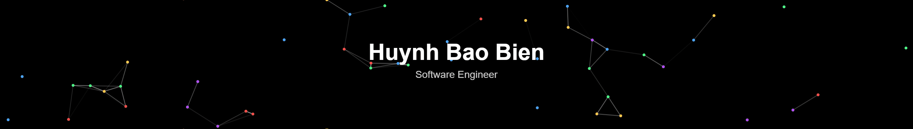

  

---

### 👋 About Me
- 🎓 Studying at **Posts and Telecommunications Institute of Technology**
- 🔬 Building: *Covid-19 Mask Detection*
- 🏗️ Building: *Document Scanner (Aruco + Computer Vision)*
- 🧠 Learning: **YOLOv8, YOLOv11, YOLOv26, PyTorch**
- 📫 Contact: **baobien.dev@gmail.com**

---

### 🛠 Tools
- 🤖 AI Coding: Claude Code · ChatGPT Codex · Cursor
- 💻 Editors: VSCode · PyCharm

---

### 🧠 Languages

  
  

---

### ⚙️ Technologies

  
  
  
  

